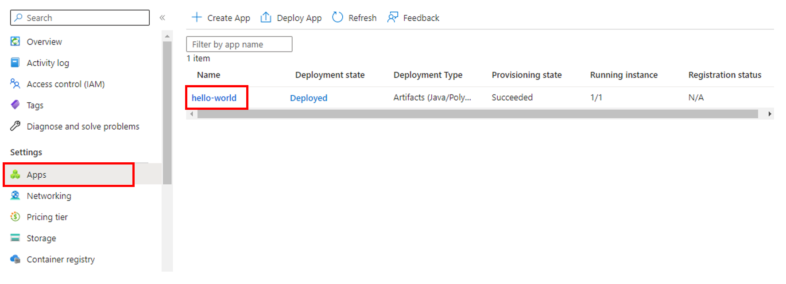
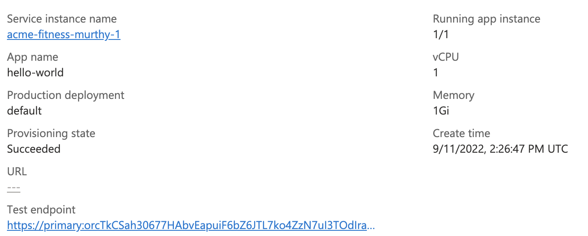

ここでは、とても単純な hello-world Spring Boot アプリを Azure Spring Apps Enterprise にデプロイしてアクセスするための方法を紹介します。

---

## Spring Boot で Hello World アプリの作成

一般的に Spring Boot アプリケーションのプロジェクトは、[https://start.spring.io/](https://start.spring.io/) の Spring Initializer を利用して作成できます。

**このワークショップでは、curl コマンド実行し Spring Initializer を呼び出します。**

>💡 __ご注意__: このワークショップで実行するコマンドは、特に指示がない場合同一ディレクトリ上で実行してください。

README と同一ディレクトリで、下記の curl コマンド ラインを実行してください。

```shell
curl https://start.spring.io/starter.tgz -d dependencies=web -d baseDir=hello-world \ -d bootVersion=2.7.5 -d javaVersion=17 -d type=maven-project | tar -xzvf -
```

> Spring Boot のバージョンを強制的に 2.7.5 に設定し、`com.example.demo` パッケージを使用するデフォルト値を使用します。

## MVC Controller を追加

`hello-world/src/main/java/com/example/demo` ディレクトリ配下に新しく `HelloController.java` ファイルを作成し、下記のコードを記述（コピー＆ペースト）してください。 同一ディレクトリ上に `DemoApplication.java` というファイルが存在しています。

```java
package com.example.demo;

import org.springframework.web.bind.annotation.GetMapping;
import org.springframework.web.bind.annotation.RestController;

@RestController
public class HelloController {

    @GetMapping("/hello")
    public String hello() {
        return "Hello from Azure Spring Apps Enterprise\n";
    }
}
```

## ローカルでプロジェクトをテスト実行

下記のコマンドでプロジェクトを実行します

```bash
cd hello-world
./mvnw spring-boot:run &
cd ..
```

実行したのち、`/hello` のエンドポイントに接続すると　"Hello from Azure Spring Apps" というメッセージが返ってきます。

```bash
curl http://127.0.0.1:8080/hello
```

最後に、実行中のアプリを強制終了します。

```bash
kill %1 (もしくは Ctrl+C)
```

上記で、hello-world のアプリが問題なくローカルで実行していることを確認しました。

## Azure Spring Apps インスタンスにアプリケーションを作成してデプロイ

下記のコマンドを実行し、Azure CLI からアプリ インスタンスを作成してください。

```bash
az spring app create -n hello-world
```

上記で、"hello-world" プロジェクトをビルドし、Azure Spring Apps Enterprise にデプロイできるようになりました。
下記のコマンドを実行し、アプリケーションをデプロイしてください。

```bash
cd hello-world
./mvnw clean package
az spring app deploy -n hello-world --artifact-path target/demo-0.0.1-SNAPSHOT.jar
cd ..
```

上記により、`mvnw claen package` でローカルディスクに jar ファイルを作成し、前の手順で作成した `hello-world` という名前のアプリ・インスタンスに対して Build Pack で内部的にコンテナを自動生成しアップロードします。この `az` コマンドは実行結果を JSON で出力します。現時点ではこの出力に注意を払う必要はありませんが、将来的には、診断とテストの目的に役立つことがわかります

## Azure Spring Apps 上でプロジェクトの動作確認

[Azure portal](https://portal.azure.com/)にアクセスしてください。

- リソース・グループで Azure Spring Apps インスタンスを検索するか、もしくは Azure ポータルの検索フィールドに名前を入力してインスタンスを検索します

- "Settings" 中の "Apps" から "hello-world" を選択します

- "Test endpoint" を探してください

- 例えば下記のような URL がテスト・エンドポイントとして表示されます
  `https://primary:<REDACTED>@hello-world.test.azuremicroservices.io/hello-world/default/`
  >💡 ご注意： `https://` と `@` の間の文字列にご注意ください。ここに記載される文字列が Basic 認証で使用されるクレデンシャルになります。つまり、この文字列が含まれない場合はこのエンドポイントにはアクセスすることができません。
- 上記の URL に `hello/` を加えてアクセスしてください。付け加えない場合エンドポイントが存在しないため "404 not found" が表示されます。

You can now use cURL again to test the `/hello` endpoint, this time served by Azure Spring Apps.  For example.

上記の URL に対し cURL コマンドを実行してテスト・エンドポイントにアクセスしてください。例えば下記のようになります。

```bash
curl https://primary:...hello-world/default/hello/
```

成功すると、下記のメッセージが表示されます。

`Hello from Azure Spring Apps Enterprise`

## ログの閲覧

下記のコマンドを実行し、Hello World アプリのログを確認してください。

```shell
az spring app logs -s ${SPRING_APPS_SERVICE} -g ${RESOURCE_GROUP} -n hello-world -f
```

## Scale App

下記のコマンドを実行し、hello-world アプリのインスタンス数を 3 にスケールアップしてください。

```shell
az spring app scale -n hello-world --instance-count 3
```

上記コマンドが正常に完了すると、Azure portal で実行中のインスタンス数がデフォルトの 1 から 3 に更新されます。


## hello-world アプリの削除

hello-world アプリのテストに成功した後、リソースを節約するためにアプリを削除してください。このアプリを削除するために、下記のコマンドを実行してください。

```bash
az spring app delete --name hello-world
```
## まとめ

おめでとうございます、最初の Spring Boot アプリを Azure Spring Apps にデプロイしました。

---

⬅️ Previous guide: [01 - Workshop Environment Setup](../01-workshop-environment-setup/README.md)

➡️ Next guide: 03 - HOL 2 - Deploy Acme Fitness frontend App
